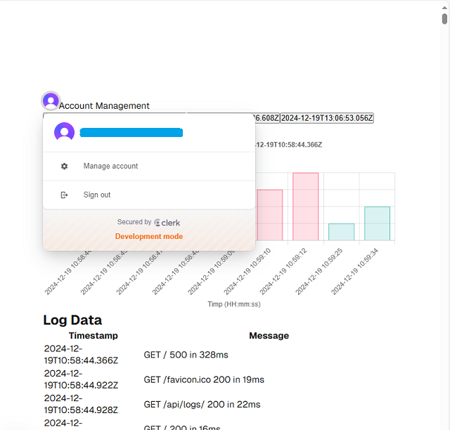
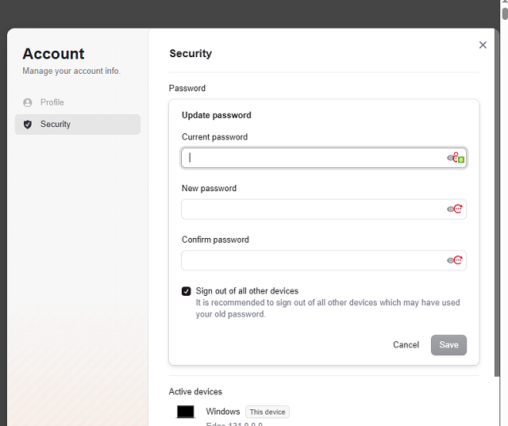
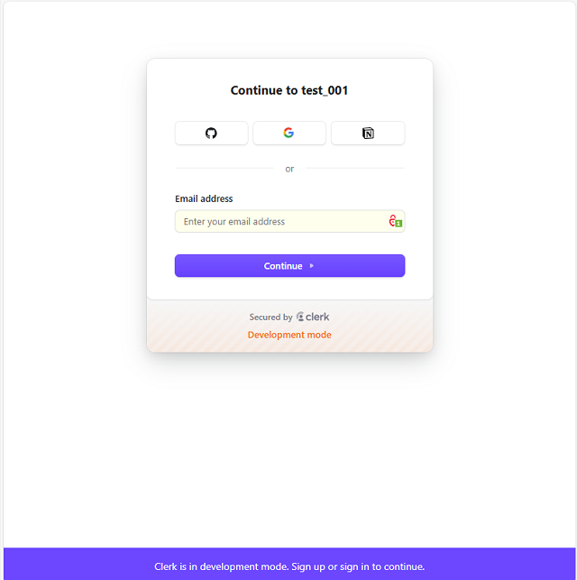

### Updates and notes 

 - because nextjs has its own routing system I show in this [branch - nextjs_buildin](https://github.com/catafest-work/clerk_001/tree/nextjs_buildin) how can be used:
   ```
   "use client";
   // Importarea componentelor necesare
   import Image from "next/image";
   import styles from "./page.module.css";
   import { SignIn, useUser, UserButton } from "@clerk/nextjs";
   // import { Link } from 'react-router-dom';
   import GraficErori from './GraficErori.client';
   import Link from 'next/link'; // Use Next.js Link instead
   
   //TODO: I removed ErowserRouter wrapper since Next.js has its own routing system.
   // Instead, I used Next.js's built-in routing. See this changes
   <div>
    <UserButton  onSignOut={() => { window.location.href = '/'; }} />
    <Link 
    href="/" 
    className="bg-blue-500 text-white px-4 py-2 rounded mt-4"
    passHref
    >
    Account Management
    </Link>
   ```
   
- TypeScript is complaining sometime about that it doesn't exist and you find into Visual Code syntax , see changes on :
   ```
    <UserButton {...props} />
   ```
   
- I don't use in this project this feature: _Clerk Elements is currently in beta with support for Next.js App Router. It is not yet recommended for production use._
- 
This is a [Next.js](https://nextjs.org) project bootstrapped with [`create-next-app`](https://nextjs.org/docs/app/api-reference/cli/create-next-app).

## Getting Started

First, run the development server:

```bash
npm run dev
# or
yarn dev
# or
pnpm dev
# or
bun dev
```

Open [http://localhost:3000](http://localhost:3000) with your browser to see the result.

You can start editing the page by modifying `app/page.tsx`. The page auto-updates as you edit the file.

This project uses [`next/font`](https://nextjs.org/docs/app/building-your-application/optimizing/fonts) to automatically optimize and load [Geist](https://vercel.com/font), a new font family for Vercel.

## Learn More

To learn more about Next.js, take a look at the following resources:

- [Next.js Documentation](https://nextjs.org/docs) - learn about Next.js features and API.
- [Learn Next.js](https://nextjs.org/learn) - an interactive Next.js tutorial.

You can check out [the Next.js GitHub repository](https://github.com/vercel/next.js) - your feedback and contributions are welcome!

## Deploy on Vercel

The easiest way to deploy your Next.js app is to use the [Vercel Platform](https://vercel.com/new?utm_medium=default-template&filter=next.js&utm_source=create-next-app&utm_campaign=create-next-app-readme) from the creators of Next.js.

Check out our [Next.js deployment documentation](https://nextjs.org/docs/app/building-your-application/deploying) for more details.

## Testing for https://clerk.com/
# clerk_001

## simple example with clerk from https://clerk.com

 - changes the run command to show the timestamp of running nextjs :
  ```
  "scripts": {
    "dev": "next dev",
    "dev-time-linux": "cross-env NEXT_LOGGER_TIMESTAMP=1 next dev | while read line; do echo \"[$(date '+%Y-%m-%d %H:%M:%S')] $line\"; done",
    "dev-time-win-cmd": "node -e \"require('child_process').spawn('node', ['./node_modules/next/dist/bin/next', 'dev'], {stdio: 'pipe'}).stdout.on('data', data => console.log(`[${new Date().toISOString()}] ${data.toString().trim()}`))\"",
    "dev-time-logs-win-cmd": "node -e \"require('child_process').spawn('node', ['./node_modules/next/dist/bin/next', 'dev'], {stdio: 'pipe'}).stdout.on('data', data => {console.log(`[${new Date().toISOString()}] ${data.toString().trim()}`); require('fs').appendFileSync('dev-time.log', `[${new Date().toISOString()}] ${data.toString().trim()}\\n`, {encoding: 'utf8'})});\"",
    "build": "next build",
    "start": "next start",
    "lint": "next lint"
  },
  ```
 - the result is :
  ```
  clerk_001>npm run dev-time-win-cmd

  > clerk_001@0.1.0 dev-time-win-cmd
  > node -e "require('child_process').spawn('node', ['./node_modules/next/dist/bin/next', 'dev'], {stdio: 'pipe'}).stdout.on('data', data => console.log(`[${new Date().toISOString()}] ${data.toString().trim()}`))"

  [2024-12-18T10:18:57.301Z] ▲ Next.js 15.1.0
  [2024-12-18T10:18:57.306Z] - Local:        http://localhost:3000
    - Network:      http://10.13.13.2:3000
    - Environments: .env.local

  ✓ Starting...
  [2024-12-18T10:18:59.218Z] ✓ Ready in 2.2s
  [2024-12-18T10:19:13.072Z] ○ Compiling /middleware ...
  [2024-12-18T10:19:13.093Z] ✓ Compiled /middleware in 530ms (215 modules)
  [2024-12-18T10:19:14.061Z] ○ Compiling / ...
  [2024-12-18T10:19:15.840Z] ✓ Compiled / in 2.3s (1174 modules)
  [2024-12-18T10:19:16.629Z] GET / 200 in 3075ms
  [2024-12-18T10:19:17.546Z] ○ Compiling /favicon.ico ...
  [2024-12-18T10:19:17.592Z] ✓ Compiled /favicon.ico in 550ms (745 modules)
  [2024-12-18T10:19:17.776Z] GET /favicon.ico 200 in 748ms
  [2024-12-18T10:19:17.901Z] GET / 200 in 93ms
  [2024-12-18T10:19:35.850Z] ✓ Compiled in 252ms (745 modules)
  ```

- tested with email and password, github 

- I used data and documentation from [the clerk.com](http://clerk.com) website.

- I created a parsing data from output of command witch is added to a dev-time.log file and I created a graphs with these data.

```
npm run dev-time-logs-win-cmd
```
- This is the resuolt of my work project:







